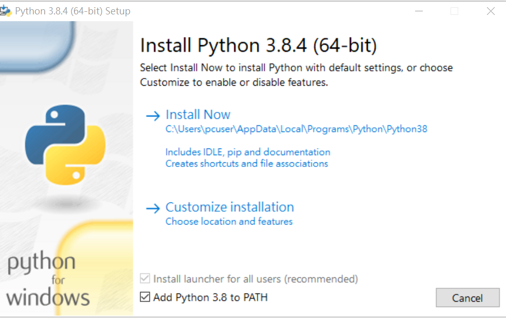

# learn-python

## 下載 python

https://www.python.org/downloads/windows/


## 安裝 python



## 進入shell
開始 > windows power shell > power shell

## 安裝jupyter-notebook

```
pip install jupyter
```

## 啟動

```
jupyter-notebook.exe
```
